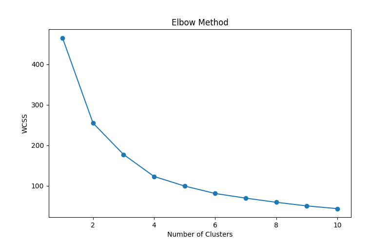
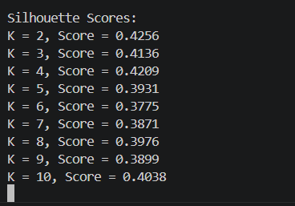
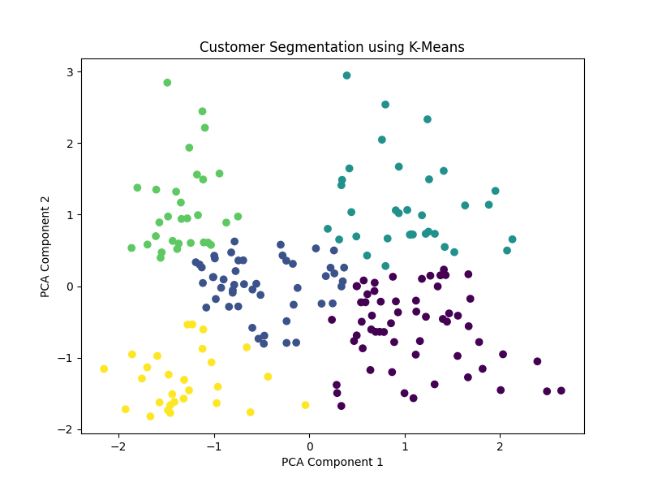

# Customer Segmentation using K-Means Clustering

## Project Overview

This project uses Unsupervised Machine Learning techniques to segment customers based on their Age, Annual Income, and Spending Score. The objective is to identify meaningful customer groups that can help businesses improve marketing strategies and customer engagement.

## Technologies Used

- Python
- Pandas
- Matplotlib
- Scikit-Learn
- PCA (Principal Component Analysis)
- K-Means Clustering

## Project Workflow

1. Data Collection
2. Data Preprocessing
3. Feature Scaling
4. Principal Component Analysis (PCA)
5. Elbow Method Analysis
6. Silhouette Score Evaluation
7. K-Means Clustering
8. Customer Segmentation Visualization

## Dataset

The dataset contains customer information such as:

- Customer ID
- Gender
- Age
- Annual Income
- Spending Score

## Results

### Elbow Method

The Elbow Method was used to determine the optimal number of clusters.

---

### Silhouette Score Analysis

Silhouette Scores were calculated to evaluate clustering performance for different values of K.

---

### Customer Segmentation Visualization

Customers were successfully grouped into different clusters using K-Means Clustering.

---

## Conclusion

Customer Segmentation helps businesses understand customer behavior, identify valuable customer groups, and make data-driven business decisions. By applying PCA and K-Means Clustering, meaningful customer segments were discovered from the dataset.

## Author

Pujitha Parimi
